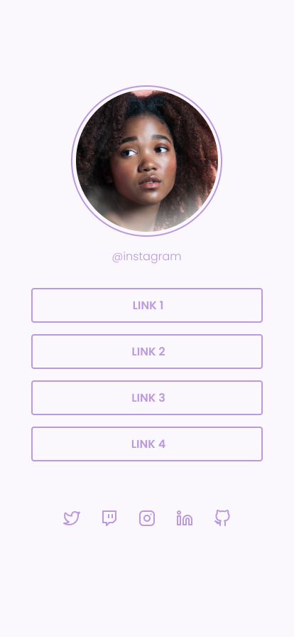

<h1 align="center"> Desafios Rocketseat </h1>

  <a href="#-tecnologias">Tecnologias</a>&nbsp;&nbsp;&nbsp;|&nbsp;&nbsp;&nbsp;
  <a href="#-projeto">Projetos</a>&nbsp;&nbsp;&nbsp;|&nbsp;&nbsp;&nbsp;
  <a href="#memo-licença">Licença</a>

  

 

## 🚀 Tecnologias

Aqui você encontrará dois projetos nivel iniciante, propostos pela plataforma de ensino Rocketseat, todos eles usam somente HTML e CSS. Os projetos também estão responsivos.

## 💻 Projetos

### Página de Receita de Waffles

  

### Página de links

 

  

## :memo: Licença

Esse projeto está sob a licença MIT.

---

Feito com ♥ by Alisson
